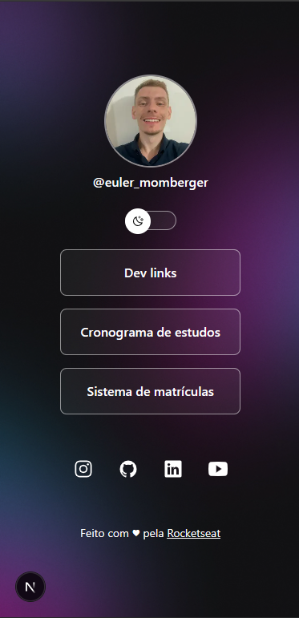

# 🔗 DevLinks

Uma aplicação desenvolvida com **Next.js** e **TypeScript** como desafio prático da formação de Next.js. O projeto consiste em uma página no estilo **Linktree**, permitindo a exibição de um avatar, links personalizados e redes sociais, com todo o conteúdo sendo gerenciado através de um CMS.

Além disso, foi implementado um **Theme Switcher** para alternância entre os temas claro e escuro.

## 🚀 Tecnologias utilizadas

- Next.js
- React
- TypeScript
- Tailwind CSS
- Prismic CMS
- next-themes

## ✨ Funcionalidades

- ✅ Layout responsivo
- ✅ Exibição do avatar
- ✅ Lista de links personalizados
- ✅ Links para redes sociais
- ✅ Conteúdo consumido diretamente do Prismic CMS
- ✅ Alternância entre tema claro e escuro

## 📸 Preview



## 🛠️ Como executar o projeto

### Clone o repositório

```bash
git clone https://github.com/eulermomberger/dev-links.git
```

### Acesse a pasta

```bash
cd dev-links
```

### Instale as dependências

```bash
npm install
```

### Execute o projeto

```bash
npm run dev
```

A aplicação estará disponível em:

```
http://localhost:3000
```

## 🎯 Objetivo do desafio

Este projeto foi desenvolvido para praticar conceitos importantes do ecossistema Next.js, incluindo:

- Estruturação de aplicações com App Router;
- Componentização;
- Consumo de dados de um Headless CMS;
- Server Components;
- Gerenciamento de temas;
- Estilização com Tailwind CSS;
- Organização de código utilizando TypeScript.

## 📖 Aprendizados

Durante o desenvolvimento deste projeto foi possível aprofundar conhecimentos em:

- Integração do Next.js com o Prismic CMS;
- Renderização de conteúdo dinâmico;
- Configuração de temas com `next-themes`;
- Componentes reutilizáveis;
- Organização de projetos escaláveis utilizando o App Router.

## 📄 Licença

Este projeto foi desenvolvido para fins de estudo como parte de um desafio da formação em Next.js da Rocketseat.
